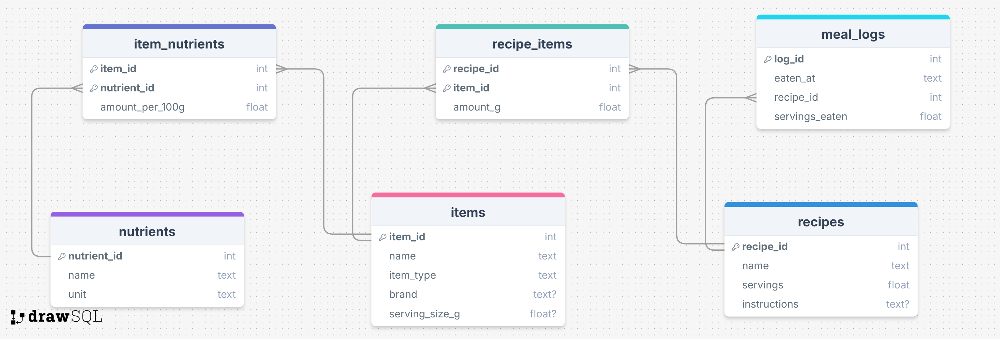

# Natural-Language-AI-SQL-Project (Recipes + Supplements)

This project demonstrates a natural language interface to a SQLite database:

**Natural language question → GPT generates SQLite SQL → SQL runs on a local DB → GPT summarizes results in plain English**

## Database purpose
Track recipes, ingredients, supplements, nutrient information (standardized per 100g), and recipe meal logs so a user can ask nutrition/food questions in plain English.

## Tech stack
- Frontend: HTML/CSS/JS (served statically)
- Backend: Node.js + Express
- Database: SQLite file generated via `sql.js` (WASM SQLite)
- AI: OpenAI API (Structured Outputs / JSON Schema)

## Setup
### 1) Install
```bash
npm install
```

### 2) Generate the SQLite database
```bash
npm run db:seed
```
This creates `db/aidb.sqlite`.

### 3) Set your OpenAI API key (DO NOT commit it)
Create a `.env` file (recommended) using `.env.example` as a template:

```bash
cp .env.example .env
```

Then edit `.env` and set `OPENAI_API_KEY=...`.

Alternatively, you can export it in your shell:
```bash
export OPENAI_API_KEY="YOUR_KEY_HERE"
```

Optional:
```bash
export OPENAI_MODEL="gpt-4o-mini"
```

### 4) Run
```bash
npm start
```
Open `http://localhost:3000`.

## Prompting strategies tried
The backend supports two primary strategies, plus an execution-guided repair loop:
- **Zero-shot**: schema + rules + question → SQL
- **Few-shot (single-domain)**: same as above + 2 in-domain examples → SQL
- **Execution-guided (repair loop)**: if SQL execution errors, the app sends the SQLite error back to GPT and requests a corrected query (max 2 retries). Empty rows are not automatically treated as failure.

You can toggle Zero-shot vs Few-shot in the UI.

## Relation to Prior Work
Our prompting strategies align with the study “How to Prompt LLMs for Text-to-SQL” (Chang & Fosler-Lussier, 2023, arXiv:2305.11853). We implemented both zero-shot and single-domain few-shot prompting strategies. Consistent with the paper’s findings, we observed improved SQL stability and correctness when using in-domain few-shot examples compared to zero-shot prompting.

## Schema picture


## Sample that worked
- **Question**: Top 5 supplements by vitamin C per 100g.
- **Generated SQL**:

```sql
SELECT i.name AS supplement_name, inut.amount_per_100g AS vitamin_c_mg
FROM items AS i
JOIN item_nutrients inut ON i.item_id = inut.item_id
JOIN nutrients AS n ON inut.nutrient_id = n.nutrient_id
WHERE i.item_type = 'supplement' AND n.name = 'vitamin_c_mg'
ORDER BY inut.amount_per_100g DESC
LIMIT 5;
```

- **Response**:
  - The top 5 supplements by vitamin C per 100g are:
    1. Vitamin C 1000mg Tablet - 62500 mg
    2. Vitamin C 500mg (SunHealth) - 17883.72 mg
    3. Vitamin C Gummies 250mg - 5000 mg
    4. Multivitamin (Once Daily) - 4285.71 mg
    5. B-Complex (DailyBasics) - 1682.54 mg

## Sample that did not work
- **Question**: What supplements did I take last week?
- **Generated SQL**:

```sql
SELECT DISTINCT i.name, i.brand
FROM meal_logs ml
JOIN recipes r ON ml.recipe_id = r.recipe_id
JOIN recipe_items ri ON r.recipe_id = ri.recipe_id
JOIN items i ON ri.item_id = i.item_id
WHERE i.item_type = 'supplement' AND ml.eaten_at >= date('now', '-7 days')
LIMIT 50;
```

- **What went wrong**:
  - This database does **not** track supplement intake in `meal_logs` (we only log recipe consumption).
  - The model tried to infer supplements from meal logs by joining through `recipe_items`, but recipes only contain ingredients in our data.
  - Result: the query returned 0 rows even though the user question sounds reasonable in a real app. This highlights a limitation: the AI can produce syntactically valid SQL that doesn't match the underlying data/modeling assumptions.

## More examples
Below are additional examples that were executed through the app (Few-shot strategy).

### Example 1
- **Question**: Top 10 ingredients by protein per 100g.
- **Generated SQL**:

```sql
SELECT i.name, i.brand, inut.amount_per_100g AS protein_g_per_100g
FROM items AS i
JOIN nutrients AS n ON n.name = 'protein_g'
JOIN item_nutrients AS inut ON inut.item_id = i.item_id AND inut.nutrient_id = n.nutrient_id
WHERE i.item_type = 'ingredient'
ORDER BY protein_g_per_100g DESC
LIMIT 10
```

- **Response (summary)**: The top results included Greek yogurt (34.5g/100g), Tempeh (31.8g/100g), Chicken breast (31g/100g), Egg (29.7g/100g), and Cottage cheese (29.5g/100g).

### Example 2
- **Question**: Show the 5 most recent meals I logged (date/time, recipe name, servings eaten).
- **Generated SQL**:

```sql
SELECT ml.eaten_at, r.name AS recipe_name, ml.servings_eaten
FROM meal_logs ml
JOIN recipes r ON r.recipe_id = ml.recipe_id
ORDER BY ml.eaten_at DESC
LIMIT 5
```

- **Response (summary)**: The app returned the 5 latest `meal_logs` entries with timestamps, recipe names, and servings eaten.

### Example 3
- **Question**: Top 5 supplements by vitamin C per 100g.
- **Generated SQL**:

```sql
SELECT i.name, i.brand, inut.amount_per_100g AS vitamin_c_mg_per_100g
FROM items i
JOIN nutrients n ON n.name = 'vitamin_c_mg'
JOIN item_nutrients inut ON inut.item_id = i.item_id AND inut.nutrient_id = n.nutrient_id
WHERE i.item_type = 'supplement'
ORDER BY vitamin_c_mg_per_100g DESC
LIMIT 5
```

- **Response (summary)**: The top 5 supplements by vitamin C per 100g were returned (with brand).

### Example 4
- **Question**: Top 5 supplements by magnesium per 100g (include brand).
- **Generated SQL**:

```sql
SELECT i.name, i.brand, inut.amount_per_100g AS magnesium_mg_per_100g
FROM items i
JOIN nutrients n ON n.name = 'magnesium_mg'
JOIN item_nutrients inut ON inut.item_id = i.item_id AND inut.nutrient_id = n.nutrient_id
WHERE i.item_type = 'supplement'
ORDER BY magnesium_mg_per_100g DESC
LIMIT 5.
```

- **Response (summary)**: The top 5 supplements by magnesium per 100g were returned (with brand).

### Example 5
- **Question**: List recipes that include Spinach.
- **Generated SQL**:

```sql
SELECT r.name, r.servings, r.instructions
FROM recipes r
JOIN recipe_items ri ON ri.recipe_id = r.recipe_id
JOIN items i ON i.item_id = ri.item_id
WHERE i.name = 'Spinach'
LIMIT 50;
```

- **Response (summary)**: The app returned recipes including Spinach (e.g., Salmon Avocado Salad, Turkey Spinach Wrap, Veggie Omelet).

### Example 6
- **Question**: Which recipes include Avocado?
- **Generated SQL**:

```sql
SELECT r.name, r.servings, r.instructions
FROM recipes r
JOIN recipe_items ri ON ri.recipe_id = r.recipe_id
JOIN items i ON i.item_id = ri.item_id
WHERE i.name = 'Avocado'
LIMIT 50;
```

- **Response**: The recipe that includes Avocado is "Salmon Avocado Salad" (serves 2).

## Notes
- The server will start without `OPENAI_API_KEY`, but `/api/ask` will return an error until you set it.
- The SQL guard only allows `SELECT` / `WITH` queries and blocks dangerous keywords (PRAGMA/ATTACH/etc.).